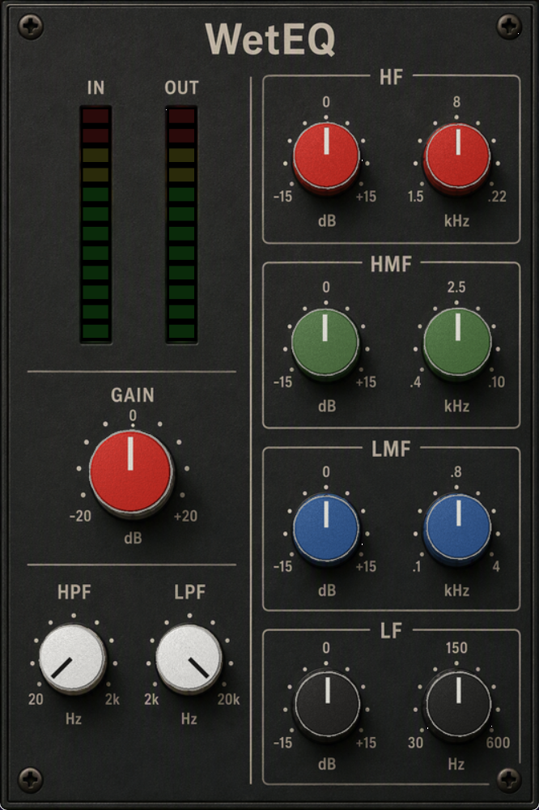
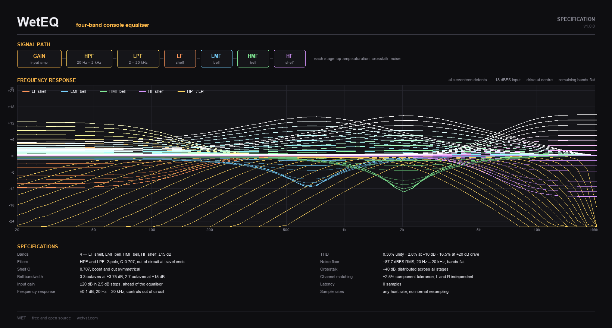

# WetEQ


A four-band console equaliser with the saturation, crosstalk and gain-dependent Q of a large-format desk.



## What it is

An analog console EQ. Each band is a circuit rather than a filter curve: every
stage is its own amplifier, saturating inside its own filter loop, bleeding a
little into the other channel and contributing its own noise.

The bells take their bandwidth from the boost/cut pot damping a gyrator tank, so
Q rises with boost the way it does on the hardware. That is why there is no Q
control on the panel.

There are eleven controls and all of them are stepped, nine positions each. You
cannot nudge this EQ by 0.4 dB, which is the point.

## Sound

With everything out of circuit the response is within ±0.1 dB from 20 Hz to
20 kHz. Nothing is resampled, quantised or band-limited, so an inserted WetEQ
does nothing at all until you turn a control.

GAIN sits ahead of the equaliser and drives the input amplifier. It is not
makeup gain and is not compensated at the output: clean at the centre detent,
2.8% THD at +10, clearly working by +20.

Boost and cut mirror each other, and at the ends of their travel the filters
leave circuit entirely.



## Controls

| | Range | Per detent |
|---|---|---|
| **GAIN** | ±20 dB | 5 dB |
| **HPF** | 20 Hz – 2 kHz | ×1.74 |
| **LPF** | 2 – 20 kHz | ×1.33 |
| **LF** shelf | 30 – 600 Hz | ×1.45 |
| **LMF** bell | 100 Hz – 4 kHz | ×1.55 |
| **HMF** bell | 400 Hz – 10 kHz | ×1.49 |
| **HF** shelf | 1.5 – 22 kHz | ×1.39 |
| **Band gain** ×4 | ±15 dB | 3.75 dB |

Frequency knobs are log-spaced with the printed endpoints exact. Mouse wheel
steps one detent per notch. Right-click the panel for **UI Zoom** — 75%, 100%
or 125%.

## Install

Grab the latest release. One download covers every platform.

| | |
|---|---|
| **Windows** | copy `WetEQ.vst3` to `C:\Program Files\Common Files\VST3\` |
| **macOS** | copy `WetEQ.vst3` to `~/Library/Audio/Plug-Ins/VST3/` |
| **Linux** | copy `WetEQ.vst3` to `~/.vst3/` |

Rescan for plugins in your DAW. Intel and Apple Silicon are both in the macOS
build.

### macOS needs one more step

The build is unsigned, so macOS quarantines it and reports that the developer
cannot be verified. That does not mean the plugin is unsafe. Clear the flag
before you rescan:

```bash
xattr -cr ~/Library/Audio/Plug-Ins/VST3/WetEQ.vst3
```

Notarising a build means enrolling in the Apple Developer Program at $99 a year,
which a free MIT plugin does not pay for. The full source is in this repo if you
would rather build it yourself.

## Build it yourself

### Prerequisites

**Windows**
- Visual Studio 2022 Build Tools or Community Edition
- CMake 3.15 or higher, Git

**Linux (Ubuntu/Debian)**
```bash
sudo apt-get install cmake gcc g++ libstdc++6 libx11-xcb-dev libxcb-util-dev \
    libxcb-cursor-dev libxcb-xkb-dev libxkbcommon-dev libxkbcommon-x11-dev \
    libfontconfig1-dev libcairo2-dev libgtkmm-3.0-dev libsqlite3-dev \
    libxcb-keysyms1-dev git
```

**macOS**
- Xcode Command Line Tools: `xcode-select --install`
- CMake 3.15+ (`brew install cmake`)

### Build steps

1. **Clone, then clone the VST3 SDK inside it:**
   ```bash
   git clone https://github.com/yonie/WetEQ.git
   cd WetEQ
   git clone --recursive https://github.com/steinbergmedia/vst3sdk.git
   ```

2. **Build:**
   - Windows: `build.bat`
   - Linux/macOS: `chmod +x build.sh && ./build.sh`

3. **Install:**
   - Windows: `install.bat`
   - Linux/macOS: `chmod +x install.sh && ./install.sh`

### Validation

The build runs the official Steinberg VST3 validator: 47 tests, all passing.

`tools/eqtest.cpp` measures the DSP with no plugin and no host — resolved knob
values against the panel legends, every band at its own centre, the
gain/bandwidth relationship, the noise floor, and that no control clicks when
you move it.

```
tools/build-eqtest.bat
```

## Licence

MIT. Free, no copy protection, no activation, no account, no launcher app.

---

Part of **[WET](https://wetvst.com)** — with [WetDelay](https://github.com/yonie/WetDelay) and [WetReverb](https://github.com/yonie/WetReverb)
